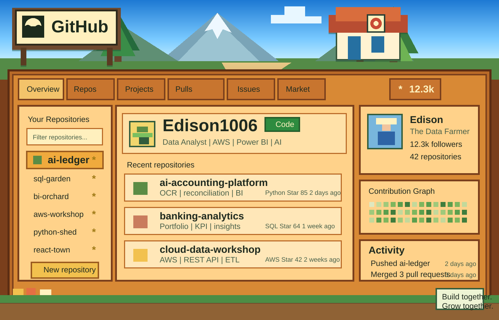

<!-- =============================== STARDEW-INSPIRED PROFILE =============================== -->

  

  
  
  
  
  
  

  
  
  
  

<!-- =============================== PLAYER PROFILE =============================== -->

<h2 id="player-profile" align="center">Player Profile</h2>

<table align="center" width="100%" border="0">
<tr>
<td width="34%" valign="top">

<table width="100%" border="1">
<tr><td align="center" bgcolor="#FFD28A">
 
<h3>Edison (Xiaoyu) Zhang</h3>
<strong>Data Analyst | Cloud Builder | AI Farmhand</strong>
  

  
Turning business questions into reliable data products.
  
</td></tr>
</table>

</td>
<td width="66%" valign="top">

<table width="100%" border="1">
<tr><td bgcolor="#FFE7B8">
 
<strong>Class:</strong> Data Analyst with 5 years of banking analytics, automation, and decision-support experience.
  
<strong>Main tools:</strong> SQL/PostgreSQL, Python, Power BI, AWS/Azure, REST APIs, ETL/ELT pipelines, and A/B testing.
  
<strong>Current storyline:</strong> Master of Software Engineering at Yoobee College, New Zealand, combining finance domain expertise with modern data and software engineering.
  
</td></tr>
</table>

</td>
</tr>
</table>

<table align="center" width="100%" border="0">
<tr>
<td align="center" width="33%">
<table width="100%" border="1"><tr><td align="center" bgcolor="#FFD28A">
 

  
<strong>AI-Powered Accounting Platform</strong>
 
for NZ SMEs at Tiaki Taonga Trust
  
</td></tr></table>
</td>
<td align="center" width="33%">
<table width="100%" border="1"><tr><td align="center" bgcolor="#FFD28A">
 

  
<strong>Business Logic to Data Solutions</strong>
 
banking insight plus engineering craft
  
</td></tr></table>
</td>
<td align="center" width="33%">
<table width="100%" border="1"><tr><td align="center" bgcolor="#FFD28A">
 

  
<strong>Cloud-Native Pipelines and AI/ML</strong>
 
React and full-stack development
  
</td></tr></table>
</td>
</tr>
</table>

<!-- =============================== INVENTORY =============================== -->

<h2 id="inventory" align="center">Inventory</h2>

<table align="center" width="100%" border="0">
<tr>
<td align="center" valign="top" width="25%">
<table width="100%" border="1"><tr><td align="center" bgcolor="#FFE7B8">
<h3>Data Crops</h3>

  

 

 

  
</td></tr></table>
</td>
<td align="center" valign="top" width="25%">
<table width="100%" border="1"><tr><td align="center" bgcolor="#FFE7B8">
<h3>Cloud Weather</h3>

  

 

 

  
</td></tr></table>
</td>
<td align="center" valign="top" width="25%">
<table width="100%" border="1"><tr><td align="center" bgcolor="#FFE7B8">
<h3>Town Board</h3>

  

 

   
</td></tr></table>
</td>
<td align="center" valign="top" width="25%">
<table width="100%" border="1"><tr><td align="center" bgcolor="#FFE7B8">
<h3>Workshop</h3>

  

 

   
</td></tr></table>
</td>
</tr>
</table>

<!-- =============================== QUEST BOARD =============================== -->

<h2 id="quest-board" align="center">Quest Board</h2>

<table align="center" width="100%" border="0">
<tr>
<td width="50%" valign="top">
<table width="100%" border="1"><tr><td bgcolor="#FFD28A">
<h3 align="center">AI-Powered SME Accounting Platform</h3>

Tiaki Taonga Trust | Aug 2025 - Present

**Role:** Data Analyst and AI Engineer | Scrum Master

| Deliverable | Reward |
|:---|:---|
| AWS Textract OCR pipeline plus Python validation | **85%** less manual entry |
| PostgreSQL reconciliation engine with CTEs and window functions | **70%** faster matching |
| Power BI reporting plus REST API integration | Stakeholder-ready analytics |

</td></tr></table>
</td>
<td width="50%" valign="top">
<table width="100%" border="1"><tr><td bgcolor="#FFD28A">
<h3 align="center">Banking Analytics and Reporting</h3>

Shanghai Pudong Development Bank | Jun 2018 - Jun 2025

**Role:** Senior Data Analyst

| Deliverable | Reward |
|:---|:---|
| SQL portfolio monitoring with joins, CTEs, and window functions | KPI tracking and risk flags |
| Python and Excel automation, reusable templates | **30%** efficiency gain |
| Power BI dashboards with Power Query ETL and DAX | Interactive risk KPIs |

</td></tr></table>
</td>
</tr>
</table>

<!-- =============================== HARVEST LEDGER =============================== -->

<h2 id="harvest-ledger" align="center">Harvest Ledger</h2>

  
  

  

  

<!-- =============================== VILLAGE RECORDS =============================== -->

<h2 id="village-records" align="center">Village Records</h2>

<table align="center" width="100%" border="0">
<tr>
<td width="55%" valign="top">
<table width="100%" border="1"><tr><td bgcolor="#FFE7B8">
<h3>Professional Experience</h3>

 **Data Analyst and AI Engineer**
 Tiaki Taonga Trust, Auckland | Aug 2025 - Present
- Architecting an AI-powered accounting platform for NZ SMEs
- Scrum Master in a 3-person Agile team
- Built AWS OCR pipeline, PostgreSQL reconciliation engine, and Power BI layer

---

 **Senior Data Analyst**
 Shanghai Pudong Development Bank, China | Jun 2018 - Jun 2025
- Corporate client coverage and financial analysis for lending/investment
- SQL datasets, automated Python/Excel workflows, Power BI dashboards
- Improved team workflow efficiency by **30%** through process optimisation

---

 **Customer Manager**
 China CITIC Bank, China | Jun 2014 - Jun 2018
- Financial services for corporate and retail clients
- Increased client satisfaction by **25%** through personalised service

</td></tr></table>
</td>
<td width="45%" valign="top">
<table width="100%" border="1"><tr><td bgcolor="#FFE7B8">
<h3>Education</h3>

**Master of Software Engineering**
 Yoobee College, New Zealand | 2025 - 2026 Expected

**Master of Business Administration**
 Anhui University, China | 2021

**BSc Computing and Information Science**
 Zhongnan Univ. of Economics and Law, China | 2014

**Bachelor of Finance**
 South-Central Univ. for Nationalities, China | 2014

---

<h3>Certifications</h3>

 Credential: <code>P3G3E5HHZ9H3</code>
  

 Credential: <code>NACYSA6F18ED</code>
  

 Credential: <code>CL2QSAR9GNQ0</code>

</td></tr></table>
</td>
</tr>
</table>

<!-- =============================== CROP CALENDAR =============================== -->

<h2 align="center">Crop Calendar</h2>

  

<!-- =============================== SALOON BOARD =============================== -->

<h2 id="saloon-board" align="center">Saloon Board</h2>

<table align="center" width="100%" border="1">
<tr>
<td align="center" bgcolor="#FFD28A">
 
<strong>Open to collaborations, opportunities, and data/tech discussions.</strong>
  

  
Built with care by <a href="https://github.com/edison1006">Edison Zhang</a>.
  
</td>
</tr>
</table>
