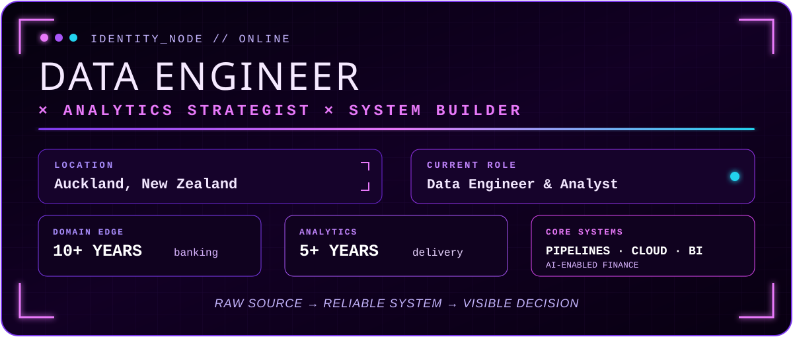
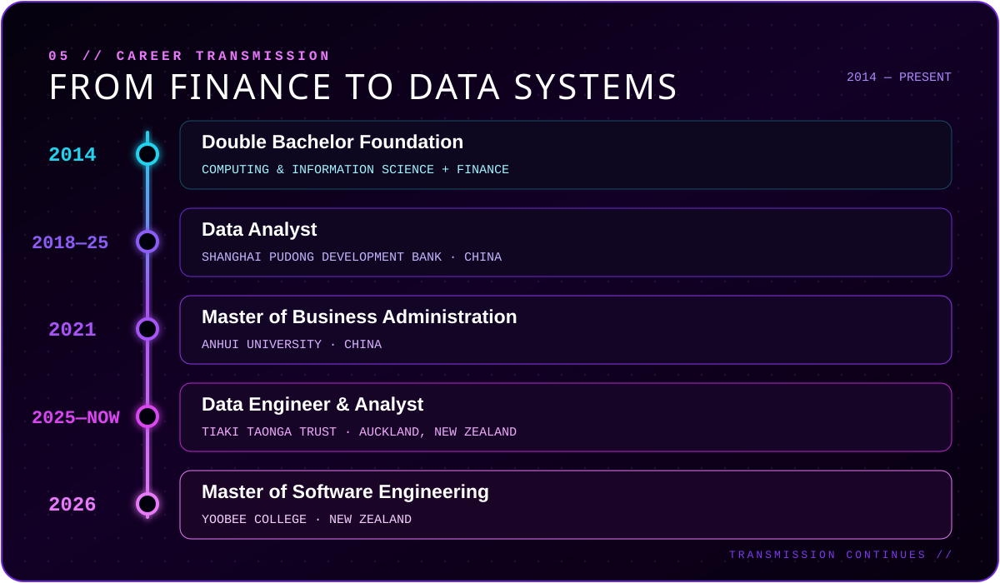

<!--
  EDISON ZHANG // PURPLE DATA NEXUS
  Profile README rebuilt from the latest CV, August 2026.
-->

  

  

  

  
  
  
  

  

> ### I engineer the bridge between **business reality** and **data systems**.
>
> From Python and SQL pipelines to cloud data environments, dimensional models, validation controls, and Power BI—I turn complex stakeholder needs into reliable products that make the answer visible.

  <table>
    <tr>
      <td align="center" width="25%"> Finance & risk domain depth</td>
      <td align="center" width="25%"> Analytics & transformation</td>
      <td align="center" width="25%"> Measured process impact</td>
      <td align="center" width="25%"> Software + business</td>
    </tr>
  </table>

<h2 align="right"><code>02 //</code> CURRENT MISSION ⚡</h2>

  
   Auckland · August 2025 — Present

 

- `DATABASE CORE` **Centralised cloud database** — consolidating structured and unstructured sources into one reliable organisational data layer.
- `PIPELINE GRID` **Automated ETL/ELT** — Python + SQL workflows for cleaning, transformation, validation, and scheduled updates.
- `SIGNAL LAYER` **Decision intelligence** — Power BI models, DAX measures, and interactive reporting for actionable insight.
- `AI PROTOCOL` **SME accounting platform** — ingestion, processing, reconciliation, analytics, and reporting in one end-to-end system.
- `DELIVERY LINK` **Cross-functional execution** — translating business requirements into tested, maintainable technical solutions.

<h2 align="center">◢ <code>03 // FEATURED BUILDS</code> ◣</h2>

<i>Selected systems from the project vault</i>

<table>
  <tr>
    <td width="50%" valign="top">
      <h3 align="center">⚡ KiwiJob</h3>
      
<code>AI job-search operating system</code>

      Chrome extension + React dashboard + FastAPI service for saving job posts, tracking applications, uploading CVs, and running AI-assisted JD ↔ CV matching.
        
      

        
        
        
        
      

      
<a href="https://github.com/edison1006/KiwiJob_Extension"><b>ENTER REPOSITORY →</b></a>

    </td>
    <td width="50%" valign="top">
      <h3 align="center">◈ NZ Financial Analytics</h3>
      
<code>Purple command centre for financial insight</code>

      A responsive financial analytics platform with authentication flows, KPI cards, trend visualisation, reporting, uploads, and a modular API service layer.
        
      

        
        
        
        
      

      
<a href="https://github.com/edison1006/New-Zealand-Financial-Analysis-Model"><b>ENTER REPOSITORY →</b></a>

    </td>
  </tr>
  <tr>
    <td width="50%" valign="top">
      <h3 align="center">◎ Lessly</h3>
      
<code>Privacy-first habit intelligence</code>

      A React Native app for setting personal limits, logging addictive habits without judgement, receiving local reminders, and understanding seven-day trends—all with on-device persistence.
        
      

        
        
        
      

      
<a href="https://github.com/edison1006/Lessly"><b>ENTER REPOSITORY →</b></a>

    </td>
    <td width="50%" valign="top">
      <h3 align="center">⌁ Cost-of-Living Intelligence</h3>
      
<code>Automated analytics & forecasting for Aotearoa</code>

      A data platform focused on automated ingestion, transformation, analysis, and forecasting of New Zealand cost-of-living signals.
        
      

        
        
        
      

      
<b>PROJECT TRANSMISSION IN PROGRESS</b>

    </td>
  </tr>
</table>

## `04 //` TECHNOLOGY **ARSENAL**

  <h3>DATA ENGINEERING</h3>
  
    
  
  
  
  
  

  <h3>BI · CLOUD · INTEGRATION</h3>
  
    
  
  
  
  
  

<h2 align="center"><code>05 //</code> VERIFIED CREDENTIALS</h2>

  
  
   
  
  

 

  

  

  
  

  

  

  <code>OPEN TO DATA ENGINEERING · ANALYTICS ENGINEERING · BI OPPORTUNITIES IN NEW ZEALAND</code>

